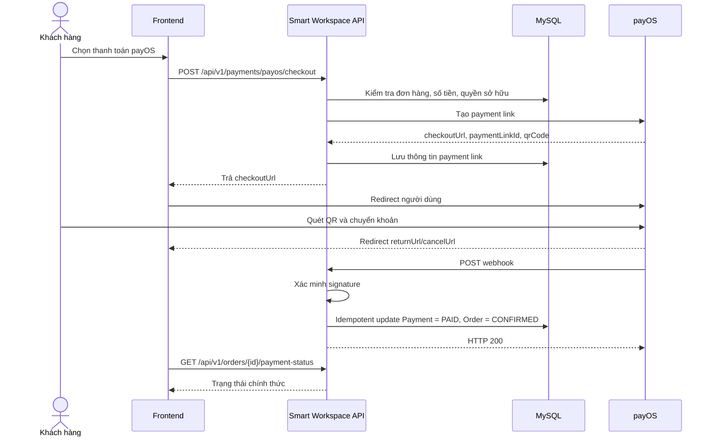

# Tích hợp thanh toán payOS cho Smart Workspace

> Phạm vi: Backend Java 17/21, Spring Boot 3, Spring Security + JWT, Spring Data JPA, MySQL, Flyway, Maven.  
> Phiên bản SDK tham chiếu: `vn.payos:payos-java:2.0.1`.

## 1. Mục tiêu

Tài liệu này mô tả cách tích hợp payOS vào luồng checkout của website Smart Workspace để:

- Tạo link thanh toán VietQR cho một đơn hàng.
- Chuyển người dùng sang trang thanh toán payOS.
- Nhận kết quả giao diện qua `returnUrl` hoặc `cancelUrl`.
- Nhận webhook từ payOS và xác minh chữ ký.
- Cập nhật `payments.payment_status` và `orders.status` an toàn, chống xử lý trùng.
- Đồng bộ lại trạng thái khi webhook bị chậm hoặc hệ thống tạm thời lỗi.

Nguyên tắc quan trọng nhất:

> `returnUrl` chỉ dùng để hiển thị giao diện. Webhook đã xác minh chữ ký mới là nguồn dữ liệu chính để ghi nhận thanh toán thành công.

---

## 2. Luồng tổng thể



---

## 3. Dữ liệu và quy tắc nghiệp vụ

### 3.1. Ánh xạ với ERD hiện tại

ERD hiện tại có quan hệ một-một giữa `orders` và `payments`. Bảng `payments` đang có các trường chính:

- `order_id`
- `payment_method`
- `payment_status`
- `transaction_code`
- `paid_at`

Để tích hợp payOS rõ ràng và dễ truy vết, nên bổ sung các trường nhà cung cấp thanh toán.

### 3.2. Flyway migration đề xuất

```sql
-- Vxx__add_payos_payment_fields.sql

ALTER TABLE payments
    MODIFY COLUMN payment_method
        ENUM('COD', 'BANK_TRANSFER', 'MOMO', 'VNPAY', 'PAYOS') NOT NULL;

ALTER TABLE payments
    ADD COLUMN provider_order_code BIGINT NULL AFTER transaction_code,
    ADD COLUMN payment_link_id VARCHAR(64) NULL AFTER provider_order_code,
    ADD COLUMN checkout_url VARCHAR(1000) NULL AFTER payment_link_id,
    ADD COLUMN provider_reference VARCHAR(100) NULL AFTER checkout_url,
    ADD COLUMN expired_at DATETIME NULL AFTER provider_reference,
    ADD COLUMN updated_at DATETIME NULL AFTER created_at,
    ADD CONSTRAINT uq_payments_provider_order_code UNIQUE (provider_order_code),
    ADD CONSTRAINT uq_payments_payment_link_id UNIQUE (payment_link_id),
    ADD CONSTRAINT uq_payments_provider_reference UNIQUE (provider_reference);
```

Nếu dự án không muốn lưu `checkout_url`, có thể bỏ cột này và tạo lại link khi cần. Tuy nhiên, với mô hình một payment cho một order, lưu link giúp tránh tạo trùng.

### 3.3. Trạng thái đề xuất

| Sự kiện | `payments.payment_status` | `orders.status` |
|---|---|---|
| Đơn vừa tạo | `UNPAID` | `PENDING` |
| Tạo link payOS thành công | `UNPAID` | `PENDING` |
| Webhook hợp lệ, đủ tiền | `PAID` | `CONFIRMED` |
| Người dùng hủy link | `UNPAID` hoặc `FAILED` tùy nghiệp vụ | `PENDING` hoặc `CANCELLED` |
| Hoàn tiền ngoài hệ thống | `REFUNDED` | tùy nghiệp vụ |

Không chuyển đơn sang `COMPLETED` sau thanh toán. `COMPLETED` chỉ nên dùng khi đơn đã giao thành công.

### 3.4. Quy tắc `orderCode`

payOS yêu cầu `orderCode` là số nguyên. ERD hiện tại dùng `orders.order_code` dạng chuỗi, vì vậy không nên truyền trực tiếp trường này.

Cách đơn giản và ổn định cho dự án:

```text
provider_order_code = orders.id
```

Điều kiện:

- Đơn hàng phải được insert vào DB trước khi gọi payOS.
- Mỗi order chỉ có một payment payOS đang hoạt động.
- Khi người dùng bấm thanh toán lại, ưu tiên trả link cũ hoặc kiểm tra trạng thái link hiện tại, không tạo `orderCode` mới tùy tiện.

### 3.5. Quy tắc số tiền

payOS nhận số tiền nguyên theo VND. Trong DB, `final_amount` là `DECIMAL`, nên chuyển đổi bằng `longValueExact()` để tránh làm tròn âm thầm.

```java
long amount = order.getFinalAmount().longValueExact();
```

Backend phải lấy số tiền từ DB. Không tin số tiền do frontend gửi lên.

### 3.6. Quy tắc mô tả thanh toán

Tài liệu payOS lưu ý mô tả có thể bị giới hạn 9 ký tự trong một số trường hợp. Dùng mã ngắn, không dấu:

```java
private String buildPayOSDescription(long orderCode) {
    String value = "SW" + Long.toString(orderCode, 36).toUpperCase();
    if (value.length() > 9) {
        throw new IllegalArgumentException("Mã mô tả payOS vượt quá 9 ký tự");
    }
    return value;
}
```

Không dùng `description` làm khóa đối soát chính. Dùng `provider_order_code`, `payment_link_id` và `provider_reference`.

---

## 4. Chuẩn bị tài khoản payOS

1. Tạo tài khoản payOS và xác thực cá nhân hoặc tổ chức.
2. Liên kết tài khoản ngân hàng.
3. Tạo kênh thanh toán.
4. Lấy ba thông tin:
   - Client ID
   - API Key
   - Checksum Key
5. Chuẩn bị URL webhook HTTPS public, ví dụ:

```text
https://api.smartworkspace.vn/api/v1/payments/payos/webhook
```

6. Đăng ký webhook trong trang quản trị payOS hoặc dùng SDK `webhooks().confirm(...)`.

Lưu ý: khi xác nhận webhook, payOS gửi một payload mẫu để kiểm tra endpoint. Payload mẫu có thể chứa `orderCode` không tồn tại trong DB. Endpoint phải xác minh chữ ký rồi trả `2xx`, không được coi đây là lỗi nghiệp vụ.

---

## 5. Biến môi trường

Không commit khóa payOS vào Git.

```env
PAYOS_CLIENT_ID=replace_me
PAYOS_API_KEY=replace_me
PAYOS_CHECKSUM_KEY=replace_me
PAYOS_BASE_URL=https://api-merchant.payos.vn

APP_FRONTEND_URL=https://smartworkspace.vn
APP_PUBLIC_API_URL=https://api.smartworkspace.vn
```

`application.yml`:

```yaml
payos:
  client-id: ${PAYOS_CLIENT_ID}
  api-key: ${PAYOS_API_KEY}
  checksum-key: ${PAYOS_CHECKSUM_KEY}
  base-url: ${PAYOS_BASE_URL:https://api-merchant.payos.vn}

app:
  frontend-url: ${APP_FRONTEND_URL:http://localhost:3000}
  public-api-url: ${APP_PUBLIC_API_URL:http://localhost:8080}
```

---

## 6. Cài SDK Java

`pom.xml`:

```xml
<dependency>
    <groupId>vn.payos</groupId>
    <artifactId>payos-java</artifactId>
    <version>2.0.1</version>
</dependency>
```

SDK chính thức hỗ trợ tạo payment link, lấy/hủy link, xác nhận webhook và xác minh chữ ký webhook.

---

## 7. Cấu hình Spring Bean

```java
package com.smartworkspace.payment.config;

import lombok.Getter;
import lombok.Setter;
import org.springframework.boot.context.properties.ConfigurationProperties;

@Getter
@Setter
@ConfigurationProperties(prefix = "payos")
public class PayOSProperties {
    private String clientId;
    private String apiKey;
    private String checksumKey;
    private String baseUrl = "https://api-merchant.payos.vn";
}
```

```java
package com.smartworkspace.payment.config;

import org.springframework.boot.context.properties.EnableConfigurationProperties;
import org.springframework.context.annotation.Bean;
import org.springframework.context.annotation.Configuration;
import vn.payos.PayOS;

@Configuration
@EnableConfigurationProperties(PayOSProperties.class)
public class PayOSConfig {

    @Bean
    public PayOS payOS(PayOSProperties properties) {
        return new PayOS(
            properties.getClientId(),
            properties.getApiKey(),
            properties.getChecksumKey()
        );
    }
}
```

---

## 8. API nội bộ của Smart Workspace

### 8.1. Tạo checkout

```http
POST /api/v1/payments/payos/checkout
Authorization: Bearer <JWT>
Content-Type: application/json
```

Request:

```json
{
  "orderId": 125
}
```

Response:

```json
{
  "orderId": 125,
  "providerOrderCode": 125,
  "paymentLinkId": "124c33293c93417ab7879e14c8d9eb18",
  "status": "PENDING",
  "checkoutUrl": "https://pay.payos.vn/web/...",
  "qrCode": "000201...",
  "expiredAt": 1783489200
}
```

### 8.2. Webhook

```http
POST /api/v1/payments/payos/webhook
Content-Type: application/json
```

Endpoint này:

- Không yêu cầu JWT.
- Phải public qua HTTPS.
- Bắt buộc xác minh chữ ký bằng SDK/checksum key.
- Phải idempotent.
- Trả `2xx` sau khi xử lý thành công hoặc nhận lại event đã xử lý.

### 8.3. Kiểm tra trạng thái

```http
GET /api/v1/orders/{orderId}/payment-status
Authorization: Bearer <JWT>
```

Response:

```json
{
  "orderId": 125,
  "paymentMethod": "PAYOS",
  "paymentStatus": "PAID",
  "orderStatus": "CONFIRMED",
  "paidAt": "2026-07-08T20:15:30+07:00"
}
```

Frontend gọi endpoint này sau khi người dùng quay về từ payOS.

---

## 9. DTO tham khảo

```java
public record CreatePayOSCheckoutRequest(Long orderId) {}
```

```java
public record CreatePayOSCheckoutResponse(
    Long orderId,
    Long providerOrderCode,
    String paymentLinkId,
    String status,
    String checkoutUrl,
    String qrCode,
    Long expiredAt
) {}
```

---

## 10. Tạo payment link

```java
package com.smartworkspace.payment.service;

import java.time.Instant;
import lombok.RequiredArgsConstructor;
import org.springframework.stereotype.Service;
import org.springframework.transaction.annotation.Transactional;
import vn.payos.PayOS;
import vn.payos.exception.PayOSException;
import vn.payos.model.v2.paymentRequests.CreatePaymentLinkRequest;
import vn.payos.model.v2.paymentRequests.CreatePaymentLinkResponse;

@Service
@RequiredArgsConstructor
public class PayOSPaymentService {

    private final PayOS payOS;
    private final OrderRepository orderRepository;
    private final PaymentRepository paymentRepository;
    private final AppUrlProperties appUrlProperties;

    @Transactional
    public CreatePayOSCheckoutResponse createCheckout(Long orderId, Long currentUserId) {
        Order order = orderRepository.findById(orderId)
            .orElseThrow(() -> new NotFoundException("Không tìm thấy đơn hàng"));

        if (!order.getUser().getId().equals(currentUserId)) {
            throw new ForbiddenException("Không có quyền thanh toán đơn hàng này");
        }

        if (order.getStatus() != OrderStatus.PENDING) {
            throw new IllegalStateException("Đơn hàng không ở trạng thái PENDING");
        }

        Payment payment = paymentRepository.findByOrderId(orderId)
            .orElseThrow(() -> new NotFoundException("Không tìm thấy bản ghi thanh toán"));

        if (payment.getPaymentStatus() == PaymentStatus.PAID) {
            throw new IllegalStateException("Đơn hàng đã được thanh toán");
        }

        if (payment.getPaymentLinkId() != null && payment.getCheckoutUrl() != null) {
            return new CreatePayOSCheckoutResponse(
                order.getId(),
                payment.getProviderOrderCode(),
                payment.getPaymentLinkId(),
                "PENDING",
                payment.getCheckoutUrl(),
                null,
                payment.getExpiredAt() == null ? null : payment.getExpiredAt().getEpochSecond()
            );
        }

        long providerOrderCode = order.getId();
        long amount = order.getFinalAmount().longValueExact();
        long expiredAt = Instant.now().plusSeconds(15 * 60).getEpochSecond();

        CreatePaymentLinkRequest request = CreatePaymentLinkRequest.builder()
            .orderCode(providerOrderCode)
            .amount(amount)
            .description(buildPayOSDescription(providerOrderCode))
            .buyerName(order.getReceiverName())
            .buyerPhone(order.getReceiverPhone())
            .returnUrl(appUrlProperties.getFrontendUrl() + "/payment/payos/return")
            .cancelUrl(appUrlProperties.getFrontendUrl() + "/payment/payos/cancel")
            .expiredAt(expiredAt)
            .build();

        try {
            CreatePaymentLinkResponse response = payOS.paymentRequests().create(request);

            payment.setPaymentMethod(PaymentMethod.PAYOS);
            payment.setProviderOrderCode(providerOrderCode);
            payment.setPaymentLinkId(response.getPaymentLinkId());
            payment.setCheckoutUrl(response.getCheckoutUrl());
            payment.setExpiredAt(Instant.ofEpochSecond(expiredAt));
            paymentRepository.save(payment);

            return new CreatePayOSCheckoutResponse(
                order.getId(),
                providerOrderCode,
                response.getPaymentLinkId(),
                response.getStatus().getValue(),
                response.getCheckoutUrl(),
                response.getQrCode(),
                response.getExpiredAt()
            );
        } catch (PayOSException ex) {
            throw new PaymentGatewayException("Không thể tạo link thanh toán payOS", ex);
        }
    }

    private String buildPayOSDescription(long orderCode) {
        String description = "SW" + Long.toString(orderCode, 36).toUpperCase();
        if (description.length() > 9) {
            throw new IllegalArgumentException("Mô tả payOS vượt quá 9 ký tự");
        }
        return description;
    }
}
```

Ghi chú triển khai:

- Không truyền `amount` từ frontend.
- Nếu đã có link hợp lệ, trả link cũ.
- Nếu link đã hết hạn, gọi API lấy trạng thái trước khi quyết định tạo lại.
- Khi payOS báo `orderCode` đã tồn tại, lấy thông tin payment link thay vì tạo trùng.

---

## 11. Xử lý webhook

### 11.1. Controller

```java
package com.smartworkspace.payment.controller;

import lombok.RequiredArgsConstructor;
import org.springframework.http.ResponseEntity;
import org.springframework.web.bind.annotation.PostMapping;
import org.springframework.web.bind.annotation.RequestBody;
import org.springframework.web.bind.annotation.RequestMapping;
import org.springframework.web.bind.annotation.RestController;
import vn.payos.model.webhooks.Webhook;

@RestController
@RequestMapping("/api/v1/payments/payos")
@RequiredArgsConstructor
public class PayOSWebhookController {

    private final PayOSWebhookService webhookService;

    @PostMapping("/webhook")
    public ResponseEntity<String> handleWebhook(@RequestBody Webhook webhook) {
        webhookService.handle(webhook);
        return ResponseEntity.ok("OK");
    }
}
```

### 11.2. Service xác minh và cập nhật DB

```java
package com.smartworkspace.payment.service;

import java.time.LocalDateTime;
import java.time.format.DateTimeFormatter;
import lombok.RequiredArgsConstructor;
import lombok.extern.slf4j.Slf4j;
import org.springframework.stereotype.Service;
import org.springframework.transaction.annotation.Transactional;
import vn.payos.PayOS;
import vn.payos.exception.PayOSException;
import vn.payos.model.webhooks.Webhook;
import vn.payos.model.webhooks.WebhookData;

@Slf4j
@Service
@RequiredArgsConstructor
public class PayOSWebhookService {

    private static final DateTimeFormatter PAYOS_DATE_TIME =
        DateTimeFormatter.ofPattern("yyyy-MM-dd HH:mm:ss");

    private final PayOS payOS;
    private final PaymentRepository paymentRepository;

    public void handle(Webhook webhook) {
        final WebhookData data;

        try {
            data = payOS.webhooks().verify(webhook);
        } catch (PayOSException | RuntimeException ex) {
            log.warn("Từ chối webhook payOS do signature không hợp lệ");
            throw new InvalidWebhookException("Webhook payOS không hợp lệ", ex);
        }

        processVerifiedWebhook(data);
    }

    @Transactional
    protected void processVerifiedWebhook(WebhookData data) {
        if (!"00".equals(data.getCode())) {
            log.info("Bỏ qua webhook payOS code={}", data.getCode());
            return;
        }

        Payment payment = paymentRepository
            .findByProviderOrderCodeForUpdate(data.getOrderCode())
            .orElse(null);

        // payOS có thể gửi payload mẫu khi xác nhận webhook URL.
        if (payment == null) {
            log.info("Webhook payOS hợp lệ nhưng không khớp orderCode={}", data.getOrderCode());
            return;
        }

        // Idempotency: payOS có thể gửi lại cùng một giao dịch.
        if (payment.getPaymentStatus() == PaymentStatus.PAID) {
            log.info("Webhook payOS đã được xử lý, orderCode={}", data.getOrderCode());
            return;
        }

        long expectedAmount = payment.getOrder().getFinalAmount().longValueExact();
        if (data.getAmount() != expectedAmount) {
            throw new PaymentValidationException(
                "Sai số tiền: expected=" + expectedAmount + ", actual=" + data.getAmount()
            );
        }

        if (!"VND".equalsIgnoreCase(data.getCurrency())) {
            throw new PaymentValidationException("Đơn vị tiền tệ không hợp lệ");
        }

        if (payment.getPaymentLinkId() != null
            && !payment.getPaymentLinkId().equals(data.getPaymentLinkId())) {
            throw new PaymentValidationException("paymentLinkId không khớp");
        }

        payment.setPaymentStatus(PaymentStatus.PAID);
        payment.setTransactionCode(data.getReference());
        payment.setProviderReference(data.getReference());
        payment.setPaymentLinkId(data.getPaymentLinkId());
        payment.setPaidAt(LocalDateTime.parse(
            data.getTransactionDateTime(),
            PAYOS_DATE_TIME
        ));

        Order order = payment.getOrder();
        if (order.getStatus() == OrderStatus.PENDING) {
            order.setStatus(OrderStatus.CONFIRMED);
        }

        paymentRepository.save(payment);
    }
}
```

### 11.3. Repository lock

```java
public interface PaymentRepository extends JpaRepository<Payment, Long> {

    Optional<Payment> findByOrderId(Long orderId);

    @Lock(LockModeType.PESSIMISTIC_WRITE)
    @Query("""
        select p
        from Payment p
        join fetch p.order o
        where p.providerOrderCode = :providerOrderCode
    """)
    Optional<Payment> findByProviderOrderCodeForUpdate(
        @Param("providerOrderCode") Long providerOrderCode
    );
}
```

Khóa ghi giúp tránh hai webhook đồng thời cùng cập nhật một payment.

### 11.4. HTTP status khi webhook lỗi

- Signature sai: trả `400 Bad Request`.
- Payload hợp lệ nhưng order không tồn tại: trả `200 OK` để hỗ trợ payload kiểm tra webhook.
- Event trùng: trả `200 OK`.
- Lỗi DB tạm thời: trả `500` và ghi log/alert. Đồng thời cần có cơ chế reconciliation vì không nên phụ thuộc tuyệt đối vào việc nhà cung cấp sẽ retry theo cách mong muốn.

`@RestControllerAdvice`:

```java
@ExceptionHandler(InvalidWebhookException.class)
public ResponseEntity<String> handleInvalidWebhook(InvalidWebhookException ex) {
    return ResponseEntity.badRequest().body("Invalid webhook");
}
```

---

## 12. Spring Security

Webhook phải được mở public nhưng chỉ đúng endpoint này.

```java
@Bean
SecurityFilterChain securityFilterChain(HttpSecurity http) throws Exception {
    http
        .csrf(csrf -> csrf.disable())
        .authorizeHttpRequests(auth -> auth
            .requestMatchers(
                HttpMethod.POST,
                "/api/v1/payments/payos/webhook"
            ).permitAll()
            .anyRequest().authenticated()
        );

    return http.build();
}
```

Nếu dự án vẫn bật CSRF, chỉ ignore endpoint webhook:

```java
csrf.ignoringRequestMatchers("/api/v1/payments/payos/webhook");
```

Không mở public toàn bộ `/api/v1/payments/**`.

---

## 13. Xử lý `returnUrl` và `cancelUrl`

payOS redirect trình duyệt về URL đã khai báo và gắn query params như:

```text
code=00
id=<paymentLinkId>
cancel=false
status=PAID
orderCode=125
```

Frontend có thể đọc các params để hiển thị trạng thái tạm thời, nhưng không tự đánh dấu đơn là đã thanh toán.

Luồng frontend khuyến nghị:

```text
1. Người dùng quay về /payment/payos/return.
2. Hiển thị “Đang xác nhận thanh toán…”.
3. Gọi GET /api/v1/orders/{orderId}/payment-status mỗi 2 giây.
4. Dừng khi paymentStatus = PAID hoặc hết 30 giây.
5. Nếu chưa PAID, cho phép người dùng bấm “Kiểm tra lại”.
```

Trang cancel:

- Không tự động xóa order.
- Có thể cho người dùng thanh toán lại.
- Backend kiểm tra link hiện tại trước khi tạo link mới.

---

## 14. Xác nhận webhook URL

Có thể cấu hình thủ công trong dashboard payOS hoặc gọi một lần bằng SDK:

```java
payOS.webhooks().confirm(
    "https://api.smartworkspace.vn/api/v1/payments/payos/webhook"
);
```

Không nên gọi `confirm()` mỗi lần ứng dụng khởi động production. Nên dùng một command quản trị, migration vận hành hoặc endpoint admin được bảo vệ.

---

## 15. Đồng bộ trạng thái dự phòng

Webhook là luồng chính, nhưng nên có endpoint/service đối soát:

```java
var paymentLink = payOS.paymentRequests().get(providerOrderCode);
```

Khi trạng thái payOS là `PAID` nhưng DB còn `UNPAID`, hệ thống có thể cập nhật sau khi kiểm tra:

- `orderCode`
- `amountPaid`
- `status`
- `paymentLinkId`

Các thời điểm nên đối soát:

- Người dùng bấm “Kiểm tra lại thanh toán”.
- Job định kỳ quét payment `UNPAID` nhưng chưa hết hạn.
- Admin mở chi tiết đơn hàng.

Không gọi API payOS liên tục theo chu kỳ quá ngắn.

---

## 16. Hủy payment link

Khi admin hủy đơn hoặc đơn hết thời gian giữ hàng:

```java
payOS.paymentRequests().cancel(
    payment.getProviderOrderCode(),
    "Order cancelled by merchant"
);
```

Chỉ hủy link khi payment chưa `PAID`. Sau đó cập nhật trạng thái DB trong cùng use case nghiệp vụ.

---

## 17. Bảo mật và vận hành

### Bắt buộc

- Chỉ lưu secret trong environment/secret manager.
- Không gửi API Key hoặc Checksum Key xuống frontend.
- Không log toàn bộ request header chứa credential.
- Luôn xác minh signature webhook.
- So khớp `orderCode`, `amount`, `currency`, `paymentLinkId` trước khi cập nhật.
- Dùng unique constraint và transaction để chống xử lý trùng.
- Webhook phải dùng HTTPS public.
- Không dùng thông tin redirect làm bằng chứng thanh toán.

### Khuyến nghị

- Mask `accountNumber` và `counterAccountNumber` trong log.
- Ghi audit log gồm `providerOrderCode`, `paymentLinkId`, `reference`, thời gian xử lý.
- Thiết lập alert khi webhook trả `5xx` hoặc sai amount.
- Đặt timeout cho request outbound và giới hạn retry hợp lý.
- Không retry tạo payment link một cách mù quáng vì có thể gặp `orderCode` đã tồn tại.

---

## 18. Kiểm thử

payOS hiện không có sandbox tách biệt. Việc test chạy trên môi trường thật, nên dùng số tiền nhỏ.

### Test case tối thiểu

| ID | Tình huống | Kết quả mong đợi |
|---|---|---|
| T01 | Tạo checkout cho order hợp lệ | Có `checkoutUrl`, DB lưu `paymentLinkId` |
| T02 | Gửi amount từ frontend giả | Backend bỏ qua, dùng amount trong DB |
| T03 | User khác thanh toán order | HTTP 403 |
| T04 | Webhook signature sai | HTTP 400, DB không đổi |
| T05 | Webhook hợp lệ, đúng amount | Payment `PAID`, Order `CONFIRMED` |
| T06 | Gửi lại webhook T05 | HTTP 200, không cập nhật trùng |
| T07 | Webhook đúng signature nhưng orderCode mẫu | HTTP 200, không tạo payment mới |
| T08 | Webhook sai amount | Không đánh dấu `PAID`, ghi cảnh báo |
| T09 | Người dùng quay lại returnUrl trước webhook | UI chờ và poll trạng thái |
| T10 | Người dùng hủy checkout | Order vẫn có thể thanh toán lại |
| T11 | Link hết hạn | Tạo/khôi phục link theo policy |
| T12 | DB lỗi khi nhận webhook | HTTP 500, có log và reconciliation |

### Test webhook bằng payload mẫu

Không nên tự tạo signature bằng tay trong test tích hợp nếu có thể dùng SDK. Với unit test, mock `payOS.webhooks().verify()` để trả về `WebhookData` đã xác minh.

---

## 19. Checklist triển khai

### Backend

- [ ] Thêm dependency payOS SDK.
- [ ] Thêm biến môi trường.
- [ ] Thêm Flyway migration.
- [ ] Bổ sung enum `PAYOS`.
- [ ] Tạo API checkout.
- [ ] Tạo webhook public.
- [ ] Xác minh signature.
- [ ] Validate amount/currency/paymentLinkId.
- [ ] Idempotency + DB lock.
- [ ] API đọc payment status.
- [ ] Reconciliation service.
- [ ] Exception mapping và logging.

### Frontend

- [ ] Nút chọn payOS.
- [ ] Redirect đến `checkoutUrl`.
- [ ] Trang return.
- [ ] Trang cancel.
- [ ] Poll payment status.
- [ ] Không tin query params để đánh dấu đã thanh toán.

### payOS Dashboard

- [ ] Tài khoản đã xác thực.
- [ ] Đã liên kết ngân hàng.
- [ ] Đã tạo payment channel.
- [ ] Đã cấu hình webhook HTTPS.
- [ ] Xác nhận webhook thành công.

### Production

- [ ] Secret không nằm trong repository.
- [ ] Domain HTTPS hoạt động.
- [ ] CORS đúng frontend domain.
- [ ] Webhook không bị JWT chặn.
- [ ] Reverse proxy chuyển đúng request body JSON.
- [ ] Có log và alert cho lỗi thanh toán.
- [ ] Test end-to-end với số tiền nhỏ.

---

## 20. Tài liệu chính thức tham chiếu

- payOS — Webhook thông tin thanh toán.
- payOS — Kiểm tra dữ liệu với signature.
- payOS — API tạo/lấy/hủy payment link và xác nhận webhook.
- payOS — Return URL.
- payOS — Java SDK.
- payOSHQ — payos-lib-java v2.0.1.
- payOS — Môi trường test.

---

## 21. Quyết định kiến trúc cho Smart Workspace

Cấu hình khuyến nghị cho bài lab:

1. Dùng redirect checkout thay vì popup/embedded để giảm độ phức tạp.
2. Một order có một payment record.
3. Dùng `orders.id` làm `provider_order_code`.
4. Webhook là nguồn xác nhận thanh toán.
5. Sau thanh toán, chuyển order từ `PENDING` sang `CONFIRMED`.
6. Frontend poll trạng thái trong tối đa 30 giây sau redirect.
7. Thêm endpoint admin để đối soát thủ công khi demo.
8. Không triển khai refund tự động trong phiên bản đầu; chỉ lưu `REFUNDED` sau khi admin đối soát.

Cách này đủ rõ ràng để demo bằng Swagger/Postman, phù hợp Spring Boot + MySQL + Flyway và tránh làm kiến trúc quá phức tạp.
