<div align="center">

# 🧠 Smart Workspace

### Website thương mại điện tử cho thương hiệu **Phòng Làm Việc Thông Minh**

**Setup thông minh · Không gian gọn gàng · Làm việc hiệu quả**

<p>
  
  
  
  
</p>

</div>

---

## 📌 Giới thiệu dự án

**Smart Workspace** là một website thương mại điện tử chuyên cung cấp các sản phẩm và combo setup cho góc học tập, làm việc và sáng tạo nội dung. Dự án tập trung vào nhóm sản phẩm như **bàn nâng hạ**, **ghế công thái học**, **đèn màn hình**, **giá đỡ laptop**, **phụ kiện quản lý cáp**, **kệ lưu trữ** và các **combo phòng làm việc thông minh**.

Điểm khác biệt của Smart Workspace không chỉ nằm ở việc bán từng sản phẩm riêng lẻ, mà là cung cấp một **giải pháp không gian làm việc trọn gói**: đẹp, gọn, tiện dụng, công thái học và phù hợp với nhu cầu của người dùng trẻ hiện nay.

Dự án được xây dựng phục vụ môn **Thương mại điện tử**, mô phỏng đầy đủ một hệ thống bán hàng online từ phía khách hàng đến phía quản trị viên.

---

## 🎯 Mục tiêu dự án

- Xây dựng một website thương mại điện tử hoàn chỉnh, có giao diện thân thiện và dễ sử dụng.
- Giúp khách hàng tìm kiếm, xem, so sánh, thêm sản phẩm vào giỏ hàng và đặt mua sản phẩm.
- Cho phép khách hàng gửi đánh giá, bình luận, feedback và xem các chính sách bán hàng.
- Cung cấp trang quản trị để admin quản lý sản phẩm, danh mục, đơn hàng, khách hàng, khuyến mại và nội dung website.
- Thiết kế hệ thống có thể mở rộng thêm các tính năng như gợi ý combo setup, thanh toán online, thống kê doanh thu và chăm sóc khách hàng.

---

## 💡 Ý tưởng kinh doanh

Smart Workspace hướng đến mô hình **D2C - Direct to Consumer**, bán trực tiếp đến người tiêu dùng thông qua website riêng. Thương hiệu định vị ở phân khúc **Affordable Premium**, tức là sản phẩm có chất lượng, thẩm mỹ và trải nghiệm tốt nhưng vẫn dễ tiếp cận hơn so với các thương hiệu cao cấp.

Khách hàng mục tiêu gồm:

- Sinh viên cần góc học tập gọn gàng, đẹp và tiện dụng.
- Lập trình viên, IT, nhân viên văn phòng thường ngồi làm việc lâu.
- Freelancer, content creator cần không gian làm việc có tính thẩm mỹ.
- Người làm việc hybrid/remote muốn nâng cấp góc làm việc tại nhà.

---

## ✨ Chức năng nổi bật

### 🛍️ Dành cho khách hàng

- Xem trang chủ với banner, sản phẩm nổi bật, combo setup và khuyến mại.
- Xem danh mục sản phẩm theo nhóm: bàn, ghế, đèn, phụ kiện, combo setup.
- Tìm kiếm sản phẩm theo tên hoặc từ khóa.
- Lọc sản phẩm theo danh mục, giá, nhu cầu sử dụng hoặc phong cách setup.
- Sắp xếp sản phẩm theo giá, sản phẩm mới, sản phẩm bán chạy hoặc đánh giá cao.
- Xem chi tiết sản phẩm gồm hình ảnh, mô tả, giá cũ, giá mới, khuyến mại và chính sách.
- Thêm sản phẩm vào giỏ hàng, cập nhật số lượng hoặc xóa sản phẩm khỏi giỏ.
- Đặt hàng, nhập thông tin nhận hàng và chọn phương thức thanh toán.
- Theo dõi trạng thái đơn hàng.
- Đánh giá, bình luận sản phẩm sau khi mua.
- Gửi feedback hoặc liên hệ với cửa hàng.
- Xem chính sách đổi trả, bảo hành, vận chuyển và thanh toán.
- Xem vị trí cửa hàng qua Google Maps.
- Giao diện responsive trên máy tính, tablet và điện thoại.

### 🧑‍💼 Dành cho quản trị viên

- Đăng nhập vào trang quản trị.
- Quản lý dashboard tổng quan: doanh thu, đơn hàng, khách hàng, sản phẩm bán chạy.
- Quản lý danh mục sản phẩm cha/con.
- Quản lý sản phẩm: thêm, sửa, xóa, ẩn/hiện sản phẩm.
- Quản lý hình ảnh sản phẩm.
- Quản lý đơn hàng và cập nhật trạng thái xử lý.
- Quản lý khách hàng và tài khoản người dùng.
- Quản lý đánh giá, bình luận và feedback.
- Quản lý mã giảm giá, banner và chương trình khuyến mại.
- Quản lý chính sách đổi trả, bảo hành, vận chuyển.
- Quản lý thông tin liên hệ và địa chỉ cửa hàng.

---

## 🧭 Các trang chính của website

### Giao diện khách hàng

| Trang | Mô tả |
|---|---|
| Trang chủ | Hiển thị banner, sản phẩm nổi bật, combo setup, khuyến mại và lời giới thiệu thương hiệu. |
| Danh mục sản phẩm | Cho phép khách hàng xem, lọc, tìm kiếm và sắp xếp sản phẩm. |
| Chi tiết sản phẩm | Hiển thị hình ảnh, thông tin, giá, đánh giá, bình luận và chính sách liên quan. |
| Giỏ hàng | Hiển thị sản phẩm đã chọn, số lượng, tổng tiền và thao tác cập nhật giỏ hàng. |
| Thanh toán | Nhập thông tin giao hàng, chọn phương thức thanh toán và xác nhận đơn hàng. |
| Đơn hàng của tôi | Theo dõi lịch sử mua hàng và trạng thái đơn hàng. |
| Liên hệ | Hiển thị form liên hệ, feedback, thông tin cửa hàng và Google Maps. |
| Chính sách | Bao gồm đổi trả, bảo hành, vận chuyển, thanh toán và bảo mật. |

### Giao diện quản trị

| Trang | Mô tả |
|---|---|
| Dashboard | Tổng quan doanh thu, đơn hàng, khách hàng và sản phẩm bán chạy. |
| Quản lý sản phẩm | Thêm, sửa, xóa, tìm kiếm và cập nhật trạng thái sản phẩm. |
| Quản lý danh mục | Tổ chức danh mục cha/con cho sản phẩm. |
| Quản lý đơn hàng | Xem chi tiết đơn, cập nhật trạng thái xử lý và giao hàng. |
| Quản lý khách hàng | Xem danh sách tài khoản, thông tin khách hàng và lịch sử mua hàng. |
| Quản lý đánh giá | Duyệt, ẩn hoặc phản hồi đánh giá sản phẩm. |
| Quản lý feedback | Xem và xử lý góp ý/liên hệ từ khách hàng. |
| Quản lý khuyến mại | Tạo mã giảm giá, banner và chương trình ưu đãi. |
| Quản lý chính sách | Cập nhật nội dung bảo hành, đổi trả và vận chuyển. |
| Quản lý cửa hàng | Cập nhật địa chỉ, hotline, email và bản đồ Google Maps. |

---

## 🛒 Quy trình mua hàng

```mermaid
flowchart LR
    A[Khách hàng truy cập website] --> B[Xem / tìm kiếm / lọc sản phẩm]
    B --> C[Xem chi tiết sản phẩm]
    C --> D[Thêm vào giỏ hàng]
    D --> E[Tiến hành thanh toán]
    E --> F[Nhập thông tin giao hàng]
    F --> G[Chọn phương thức thanh toán]
    G --> H[Xác nhận đơn hàng]
    H --> I[Admin xử lý đơn]
    I --> J[Giao hàng]
    J --> K[Khách hàng đánh giá / feedback]
```



---

## 🧩 Nhóm chức năng hệ thống

| Nhóm chức năng | Nội dung |
|---|---|
| Tài khoản | Đăng ký, đăng nhập, đăng xuất, phân quyền khách hàng/admin. |
| Sản phẩm | Quản lý sản phẩm, ảnh sản phẩm, giá, mô tả, tồn kho và trạng thái hiển thị. |
| Danh mục | Phân loại sản phẩm theo nhóm và danh mục cha/con. |
| Tìm kiếm & lọc | Hỗ trợ tìm kiếm, lọc và sắp xếp sản phẩm. |
| Giỏ hàng | Thêm sản phẩm, cập nhật số lượng, xóa sản phẩm và tính tổng tiền. |
| Đơn hàng | Tạo đơn, xem chi tiết đơn và cập nhật trạng thái đơn hàng. |
| Thanh toán | Hỗ trợ COD, chuyển khoản hoặc mô phỏng ví điện tử/cổng thanh toán. |
| Đánh giá | Khách hàng đánh giá sản phẩm, bình luận và phản hồi. |
| Feedback | Gửi góp ý, liên hệ và yêu cầu hỗ trợ. |
| Khuyến mại | Quản lý giá cũ, giá mới, mã giảm giá và chương trình ưu đãi. |
| Chính sách | Hiển thị chính sách đổi trả, bảo hành, vận chuyển và thanh toán. |
| Cửa hàng | Hiển thị thông tin liên hệ và vị trí cửa hàng trên Google Maps. |
| Quản trị | Dashboard, quản lý dữ liệu và theo dõi hoạt động kinh doanh. |

---

## 🧬 Database tổng quan

Các nhóm bảng chính trong hệ thống:

```text
users, roles, user_roles, addresses
categories, products, product_images
carts, cart_items
orders, order_items, payments
product_reviews, product_comments
feedbacks, promotions, policies, store_locations
```

ERD của dự án được thiết kế bằng **draw.io / diagrams.net**, thể hiện các quan hệ chính giữa người dùng, sản phẩm, giỏ hàng, đơn hàng, đánh giá, feedback và trang quản trị.

---

## 🧱 Công nghệ sử dụng

> Có thể điều chỉnh phần này theo đúng source code thực tế của nhóm.

| Thành phần | Công nghệ / Công cụ |
|---|---|
| Frontend | HTML, CSS, JavaScript / React / Bootstrap / Tailwind CSS |
| Backend | Java, Spring Boot / hoặc framework backend nhóm sử dụng |
| Database | MySQL |
| API | RESTful API |
| Authentication | Session / JWT tùy triển khai |
| Design UI | Figma, Canva, Google Stitch hoặc công cụ thiết kế giao diện |
| ERD | draw.io, diagrams.net |
| Báo cáo | Microsoft Word |
| Trình chiếu | PowerPoint / Canva |
| Quản lý source | Git, GitHub |

---

## 🗂️ Cấu trúc thư mục đề xuất

```bash
smart-workspace/
├── frontend/                 # Giao diện khách hàng và quản trị
│   ├── assets/               # Hình ảnh, icon, font, CSS, JS
│   ├── pages/                # Các trang giao diện
│   ├── components/           # Header, footer, product card, sidebar, modal
│   └── README.md
│
├── backend/                  # API và xử lý nghiệp vụ
│   ├── src/                  # Source code backend
│   ├── database/             # Script SQL / migration
│   └── README.md
└── README.md                 # Giới thiệu tổng quan dự án
```


## ⚙️ Hướng dẫn chạy dự án

### 1. Clone repository

```bash
git clone <repository-url>
cd smart-workspace
```

### 2. Cấu hình database

Tạo database MySQL:

```sql
CREATE DATABASE smart_workspace CHARACTER SET utf8mb4 COLLATE utf8mb4_unicode_ci;
```

Import file SQL hoặc chạy migration theo source của nhóm.

### 3. Chạy backend

```bash
cd backend
# Ví dụ nếu dùng Spring Boot
mvn spring-boot:run
```

### 4. Chạy frontend

```bash
cd frontend
# Nếu dùng HTML/CSS/JS thuần: mở file index.html
# Nếu dùng React/Vite:
npm install
npm run dev
```

### 5. Truy cập website

```text
Frontend: http://localhost:5173
Backend API: http://localhost:8080
```

---

## 🖼️ Demo giao diện

> Thêm ảnh chụp màn hình vào thư mục `docs/screenshots/` rồi cập nhật đường dẫn bên dưới.

| Trang chủ | Danh mục sản phẩm | Chi tiết sản phẩm |
|---|---|---|
| `docs/screenshots/home.png` | `docs/screenshots/products.png` | `docs/screenshots/product-detail.png` |

| Giỏ hàng | Thanh toán | Admin Dashboard |
|---|---|---|
| `docs/screenshots/cart.png` | `docs/screenshots/checkout.png` | `docs/screenshots/admin-dashboard.png` |

---

## ✅ Checklist chức năng

- [ ] Trang chủ responsive.
- [ ] Danh sách sản phẩm.
- [ ] Tìm kiếm sản phẩm.
- [ ] Lọc và sắp xếp sản phẩm.
- [ ] Chi tiết sản phẩm có hình ảnh, giá cũ, giá mới, khuyến mại.
- [ ] Đăng ký, đăng nhập, đăng xuất.
- [ ] Giỏ hàng.
- [ ] Thanh toán / đặt hàng.
- [ ] Liên hệ và feedback.
- [ ] Chính sách đổi trả, bảo hành, vận chuyển.
- [ ] Google Maps.
- [ ] Đánh giá sản phẩm và bình luận.
- [ ] Trang quản trị.
- [ ] Quản lý sản phẩm, danh mục, đơn hàng, khách hàng.
- [ ] Giao diện hiển thị tốt trên desktop, tablet và mobile.

---

## 🚀 Định hướng phát triển

- Gợi ý combo setup theo nhu cầu: học tập, lập trình, sáng tạo nội dung, làm việc hybrid.
- Tích hợp thanh toán điện tử như VNPay, MoMo hoặc ZaloPay.
- Thêm thông báo đơn hàng qua email hoặc Zalo.
- Tối ưu SEO cho trang sản phẩm và bài viết tư vấn setup.
- Phát triển wishlist, mã giảm giá cá nhân hóa và chương trình tích điểm.
- Bổ sung dashboard thống kê doanh thu, tỷ lệ chuyển đổi và sản phẩm bán chạy.
- Nghiên cứu tính năng xem trước setup bằng 3D/AR trong tương lai.

---

## 👥 Thành viên nhóm

| STT | Họ tên | MSSV | Vai trò | Mức độ tham gia |
|---|---|---|---|---|
| 1 | Nguyễn Văn A | 000000000 | Frontend / UI | 100% |
| 2 | Nguyễn Văn B | 000000000 | Backend / Database | 100% |
| 3 | Nguyễn Văn C | 000000000 | Báo cáo / Slide | 100% |
| 4 | Nguyễn Văn D | 000000000 | Kiểm thử / Tài liệu | 100% |

---

## 📚 Tài liệu liên quan

- Đề bài Case Study môn Thương mại điện tử.
- Kế hoạch kinh doanh thương hiệu Smart Workspace.
- File ERD Smart Workspace.
- Báo cáo Word.
- Slide thuyết trình.
- Source code website.

---

## 📄 Ghi chú

Dự án được thực hiện phục vụ mục đích học tập trong môn **Thương mại điện tử**. Các thông tin, chức năng và giao diện có thể được điều chỉnh theo yêu cầu giảng viên và tiến độ triển khai thực tế của nhóm.

---

<div align="center">

### Made with 💻 by Smart Workspace Team

**UTH · E-commerce Course Project**

</div>
