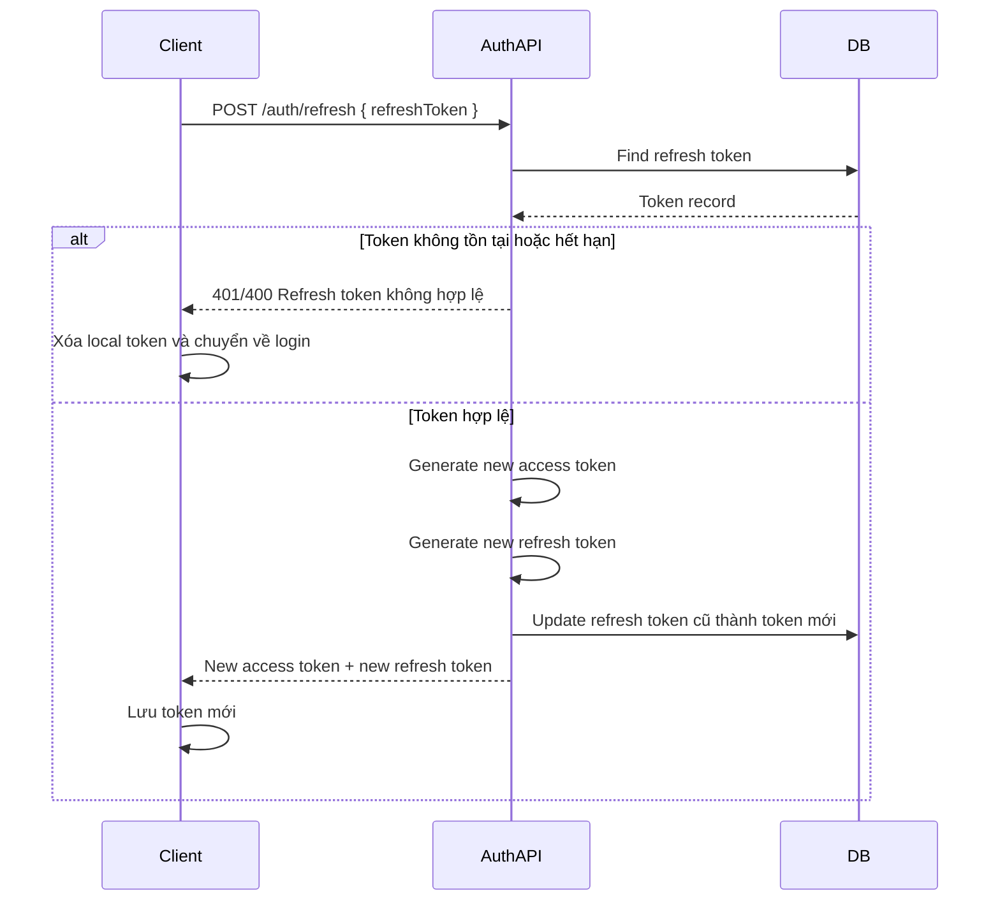
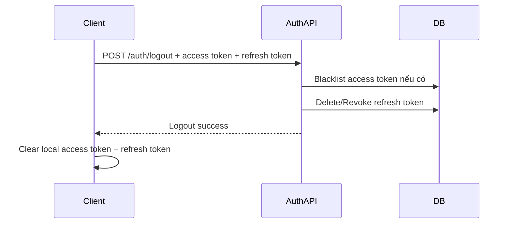

# Auth Flow — Access Token, Refresh Token, Logout

## 1. Mục tiêu

Hệ thống auth sử dụng 2 loại token:

* Access Token: dùng để gọi API cần đăng nhập.
* Refresh Token: dùng để xin Access Token mới khi Access Token hết hạn.

Mục tiêu của flow này là:

* Access Token sống ngắn, ví dụ 5 phút.
* Refresh Token sống dài hơn, ví dụ 7 ngày hoặc 30 ngày.
* Khi refresh token được dùng thành công, hệ thống cấp refresh token mới và làm refresh token cũ mất hiệu lực.
* Khi logout, hệ thống revoke refresh token để người dùng không thể lấy access token mới nữa.
* Access token cũ không cần blacklist mỗi lần refresh, vì nó sẽ tự hết hạn sau thời gian ngắn.

## 2. Thành phần chính

### Access Token

Access token là JWT, chứa thông tin như:

```txt
uid
email
issuer
issued_at
expired_at
```

Access token được gửi trong header khi gọi API:

```http
Authorization: Bearer <access_token>
```

Access token nên có thời gian sống ngắn, ví dụ:

```txt
5 phút
```

Khi access token hết hạn, client không bắt user đăng nhập lại ngay, mà dùng refresh token để xin access token mới.

### Refresh Token

Refresh token là token random, không cần là JWT.

Refresh token được lưu trong database, bảng ví dụ:

```txt
refresh_tokens
- id
- user_id
- refresh_token
- expiry_date
- created_at
- updated_at
```

Refresh token dùng để xin access token mới qua endpoint:

```http
POST /api/v1/auth/refresh
```

Body:

```json
{
  "refreshToken": "<refresh_token>"
}
```

## 3. Login Flow

### Endpoint

```http
POST /api/v1/auth/login
```

### Request

```json
{
  "email": "user@gmail.com",
  "password": "123456"
}
```

### Flow xử lý

```txt
1. Client gửi email và password.
2. Backend tìm user theo email.
3. Backend kiểm tra password bằng PasswordEncoder.
4. Nếu sai email/password thì trả 401 Unauthorized.
5. Nếu đúng:
   - Tạo access token.
   - Tạo refresh token.
   - Lưu refresh token vào database.
   - Trả access token và refresh token về client.
```

### Response thành công

```json
{
  "accessToken": "<access_token>",
  "refreshToken": "<refresh_token>",
  "user": {
    "id": 1,
    "email": "user@gmail.com"
  }
}
```

### Ghi chú

Nếu mỗi user chỉ có một refresh token trong database, thì mỗi lần login mới có thể ghi đè refresh token cũ.

Điều này có nghĩa là khi user login ở thiết bị mới, refresh token ở thiết bị cũ có thể bị mất hiệu lực.

Nếu muốn hỗ trợ nhiều thiết bị đăng nhập cùng lúc, bảng refresh token nên cho phép nhiều dòng theo `user_id`.

## 4. Gọi API bình thường

### Request

```http
GET /api/v1/users/me
Authorization: Bearer <access_token>
```

### Flow xử lý

```txt
1. JwtAuthFilter lấy access token từ Authorization header.
2. Kiểm tra format token.
3. Kiểm tra chữ ký token.
4. Kiểm tra issuer.
5. Kiểm tra token đã hết hạn chưa.
6. Kiểm tra token có nằm trong blacklist không.
7. Nếu hợp lệ thì set Authentication vào SecurityContext.
8. Controller xử lý request.
```

### Các lỗi thường gặp

```txt
Access token sai format -> 401
Access token sai chữ ký -> 401
Access token hết hạn -> 401
Access token bị blacklist -> 401
User không còn tồn tại -> 401
Không đủ quyền -> 403
```

## 5. Refresh Token Flow

### Endpoint

```http
POST /api/v1/auth/refresh
```

### Request

```json
{
  "refreshToken": "<old_refresh_token>"
}
```

### Flow xử lý chuẩn

```txt
1. Client gửi refresh token cũ lên server.
2. Backend kiểm tra refresh token có tồn tại trong database không.
3. Backend kiểm tra refresh token đã hết hạn chưa.
4. Nếu token không tồn tại hoặc đã hết hạn:
   - Trả lỗi.
   - Client xóa token local.
   - Client chuyển user về màn hình login.
5. Nếu token hợp lệ:
   - Lấy user tương ứng với refresh token.
   - Tạo access token mới.
   - Tạo refresh token mới.
   - Cập nhật refresh token mới vào database.
   - Trả access token mới và refresh token mới về client.
```

### Response thành công

```json
{
  "accessToken": "<new_access_token>",
  "refreshToken": "<new_refresh_token>"
}
```

### Flow diagram



### Có cần blacklist access token cũ khi refresh không?

Không cần.

Lý do:

```txt
Access token cũ chỉ sống khoảng 5 phút.
Nếu blacklist access token mỗi lần refresh, backend phải lưu và check blacklist nhiều hơn.
Việc đó làm hệ thống phức tạp hơn nhưng lợi ích không nhiều.
```

Cách hợp lý:

```txt
Access token cũ -> để tự hết hạn.
Refresh token cũ -> revoke/update ngay sau khi refresh thành công.
```

## 6. Logout Current Device Flow

Logout hiện tại nên hiểu là đăng xuất phiên hiện tại, tức là revoke refresh token đang dùng ở thiết bị đó.

### Endpoint đề xuất

```http
POST /api/v1/auth/logout
Authorization: Bearer <access_token>
Content-Type: application/json
```

### Request

```json
{
  "refreshToken": "<refresh_token>"
}
```

### Flow xử lý

```txt
1. Client gọi logout.
2. Client gửi access token trong Authorization header nếu còn.
3. Client gửi refresh token trong body.
4. Backend lấy access token từ Authorization header.
5. Nếu access token tồn tại và hợp lệ format:
   - Đưa access token vào blacklist.
6. Backend lấy refresh token từ body.
7. Backend tìm refresh token trong database.
8. Nếu tồn tại:
   - Xóa refresh token khỏi database hoặc set revoked_at.
9. Backend trả logout success.
10. Client xóa access token và refresh token khỏi localStorage/sessionStorage.
```

### Response

```json
{
  "message": "Đăng xuất thành công"
}
```

### Flow diagram



### Vì sao logout phải revoke refresh token?

Nếu chỉ blacklist access token thì chưa đủ.

Vì access token chỉ dùng để gọi API. Refresh token mới là thứ dùng để xin access token mới.

Nếu logout mà refresh token vẫn còn sống, client hoặc attacker vẫn có thể gọi:

```http
POST /api/v1/auth/refresh
```

và lấy access token mới.

Vì vậy logout bắt buộc phải xử lý refresh token.

## 7. Logout All Devices Flow

Logout all devices dùng khi user muốn đăng xuất khỏi tất cả thiết bị, hoặc sau khi đổi mật khẩu.

### Endpoint đề xuất

```http
POST /api/v1/auth/logout-all
Authorization: Bearer <access_token>
```

### Flow xử lý

```txt
1. Client gửi access token.
2. Backend lấy userId từ access token.
3. Backend xóa/revoke toàn bộ refresh token của user đó.
4. Có thể blacklist access token hiện tại.
5. Backend trả success.
6. Client hiện tại xóa token local.
```

### Response

```json
{
  "message": "Đã đăng xuất khỏi tất cả thiết bị"
}
```

### Ghi chú

Nếu database chỉ lưu một refresh token trên mỗi user, logout all devices gần giống logout thường.

Nếu database hỗ trợ nhiều refresh token trên nhiều thiết bị, logout all devices sẽ xóa tất cả token có cùng `user_id`.

## 8. Đổi mật khẩu Flow

Sau khi đổi mật khẩu, nên revoke toàn bộ refresh token của user.

### Flow xử lý

```txt
1. User gọi API đổi mật khẩu.
2. Backend kiểm tra mật khẩu cũ.
3. Backend validate mật khẩu mới.
4. Backend cập nhật password mới.
5. Backend revoke toàn bộ refresh token của user.
6. Backend blacklist access token hiện tại nếu cần.
7. Backend yêu cầu user đăng nhập lại.
```

Lý do:

```txt
Nếu tài khoản bị lộ mật khẩu, attacker có thể đang giữ refresh token.
Đổi mật khẩu mà không revoke refresh token thì attacker vẫn có thể tiếp tục refresh token.
```

## 9. Case Refresh Token bị dùng lại

Nếu hệ thống dùng refresh token rotation, refresh token cũ chỉ được dùng một lần.

Flow chuẩn:

```txt
1. Client dùng refresh token A.
2. Backend xác thực token A hợp lệ.
3. Backend cấp access token mới.
4. Backend cấp refresh token B.
5. Backend revoke token A.
6. Từ lúc này token A không còn hợp lệ.
```

Nếu sau đó có request dùng lại token A:

```txt
1. Backend không tìm thấy token A trong database.
2. Backend hiểu đây có thể là token cũ hoặc token bị đánh cắp.
3. Backend trả lỗi.
4. Có thể revoke toàn bộ refresh token của user để an toàn hơn.
```

Với đồ án, có thể xử lý đơn giản:

```txt
Token không tồn tại -> trả lỗi refresh token không hợp lệ.
```

Bản bảo mật hơn:

```txt
Token cũ bị dùng lại -> revoke toàn bộ session của user.
```

## 10. Có cần lưu Access Token trong database không?

Không cần lưu access token trong database.

Access token là JWT stateless. Backend chỉ cần:

```txt
- Verify chữ ký.
- Kiểm tra hết hạn.
- Kiểm tra issuer.
- Kiểm tra blacklist khi cần.
```

Chỉ lưu access token vào blacklist trong các trường hợp:

```txt
- User logout.
- User đổi mật khẩu.
- Admin khóa tài khoản.
- Token nghi ngờ bị lộ.
```

Không nên blacklist access token mỗi lần refresh.

## 11. Client Storage Flow

Với repo hiện tại, token đang trả về JSON nên frontend thường lưu như sau:

```txt
accessToken -> localStorage hoặc memory
refreshToken -> localStorage hoặc memory
```

Sau login:

```txt
Lưu accessToken.
Lưu refreshToken.
```

Sau refresh thành công:

```txt
Ghi đè accessToken cũ bằng accessToken mới.
Ghi đè refreshToken cũ bằng refreshToken mới.
```

Sau logout:

```txt
Xóa accessToken.
Xóa refreshToken.
Redirect về trang login.
```

Bản tốt hơn cho production:

```txt
accessToken -> memory
refreshToken -> HttpOnly Secure Cookie
```

Nhưng với project hiện tại, dùng body `{ refreshToken }` là dễ áp dụng nhất.

## 12. Tổng kết flow chuẩn cho project hiện tại

```txt
Login:
- Check email/password.
- Tạo access token.
- Tạo refresh token.
- Lưu refresh token vào DB.
- Trả cả 2 token cho client.

Call API:
- Gửi access token trong Authorization header.
- Backend verify JWT.
- Check blacklist.
- Cho phép hoặc từ chối request.

Refresh:
- Client gửi refresh token.
- Backend check refresh token trong DB.
- Nếu hợp lệ:
  - Tạo access token mới.
  - Tạo refresh token mới.
  - Update refresh token trong DB.
  - Trả token mới.
- Access token cũ không cần blacklist.

Logout:
- Client gửi access token nếu còn.
- Client gửi refresh token trong body.
- Backend blacklist access token nếu cần.
- Backend xóa/revoke refresh token.
- Client xóa token local.

Logout all devices:
- Backend lấy userId từ access token.
- Xóa/revoke toàn bộ refresh token của user.
- Client xóa token local.
```
